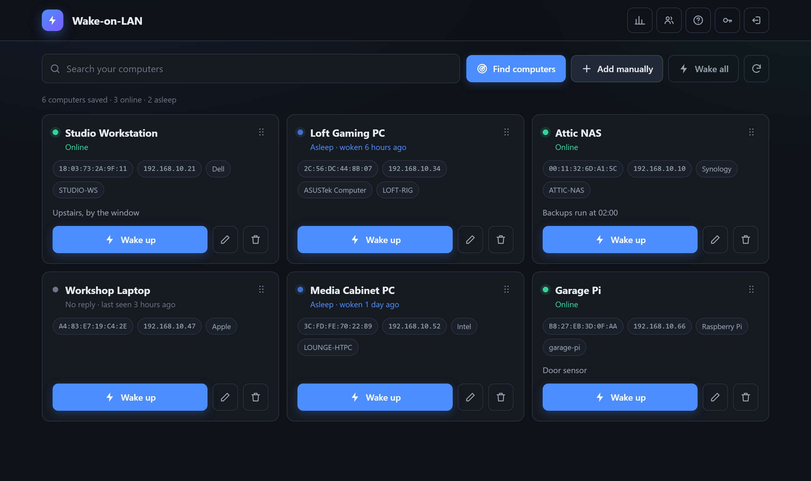
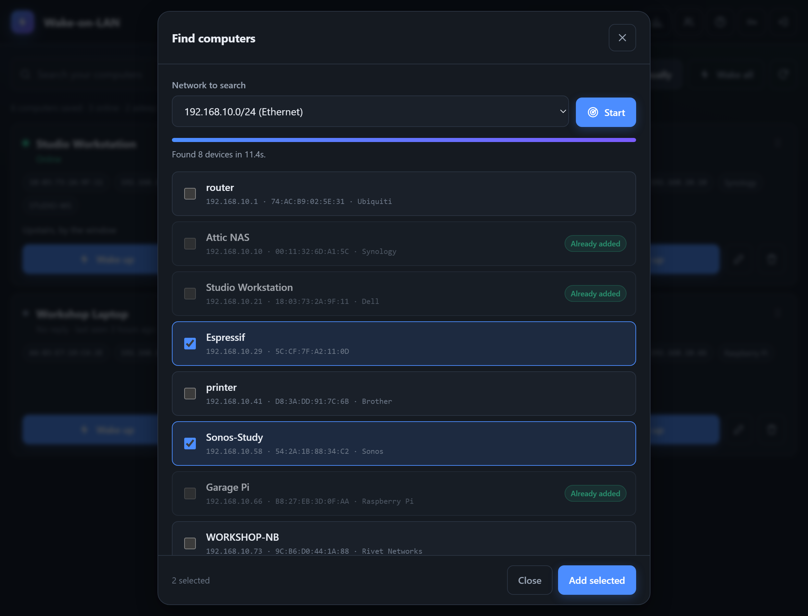
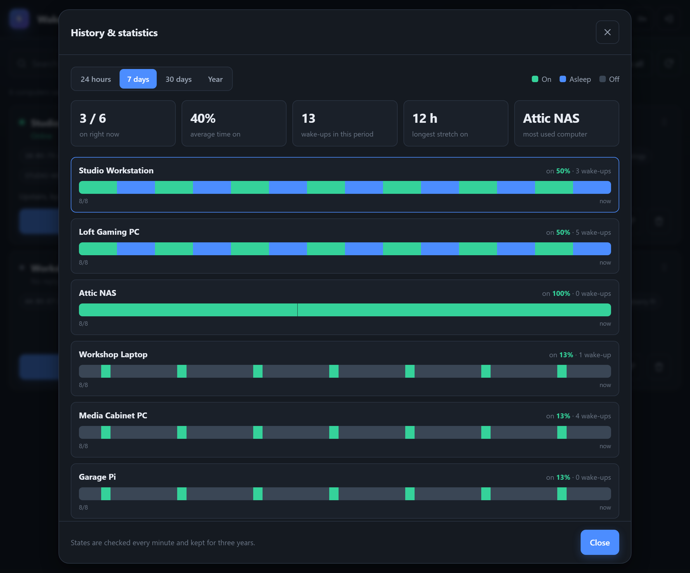
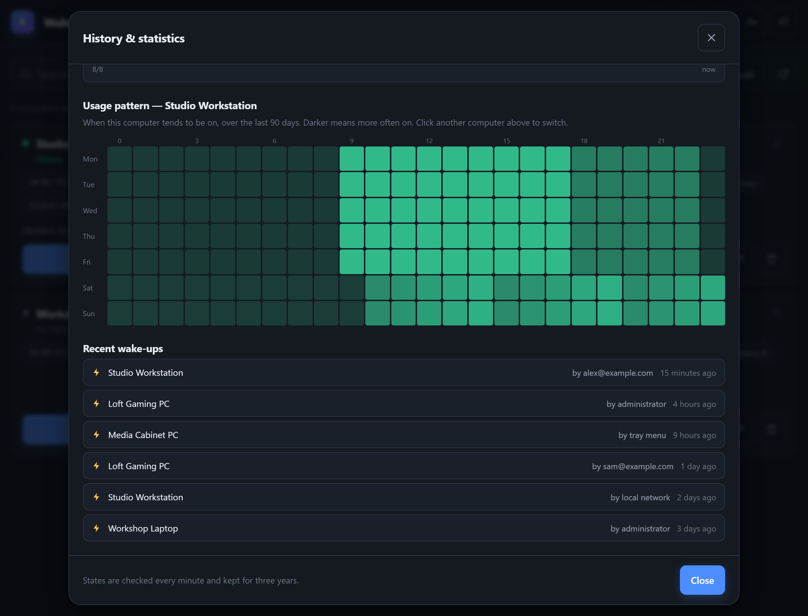
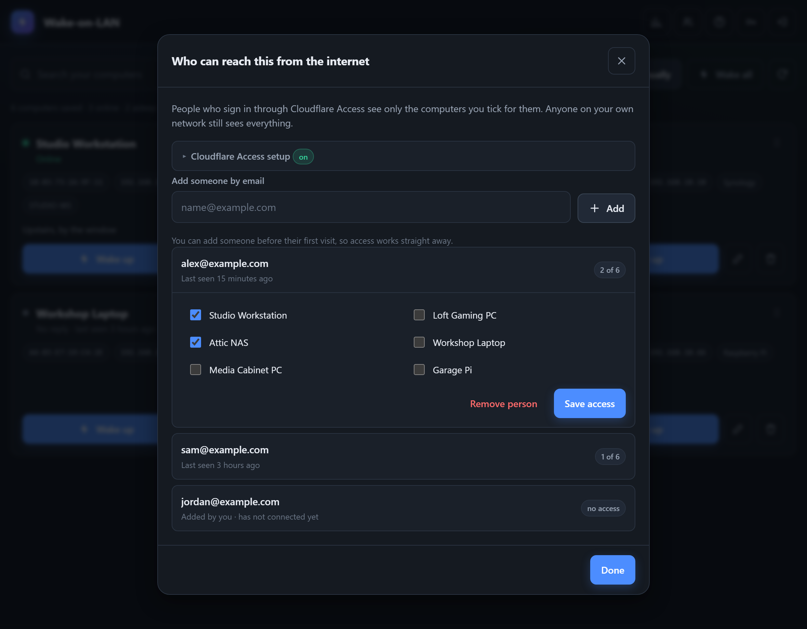
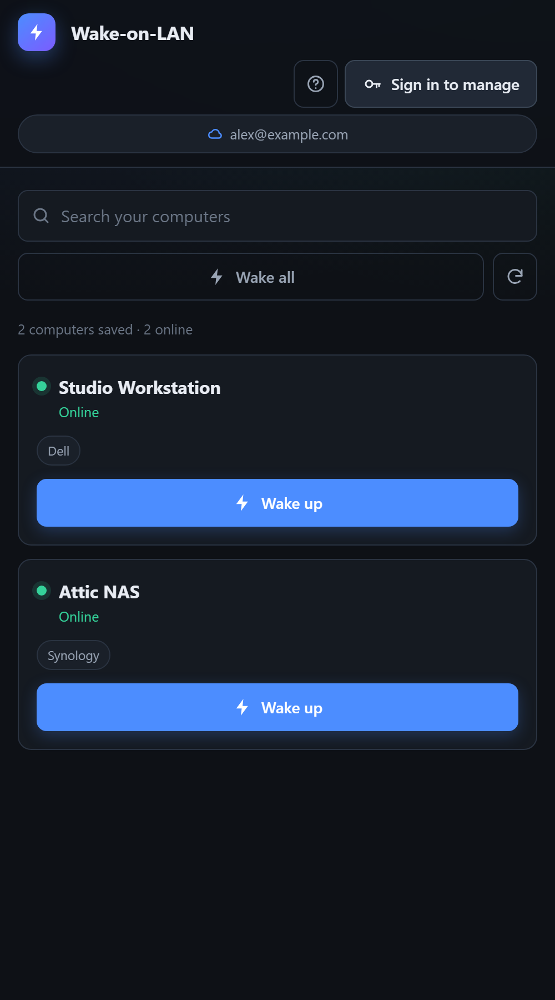

# WoL-go

Wake your computers over the network from a browser, a phone, or the Windows
system tray. Single binary, no dependencies, embedded web interface.


> **Written by AI.** Nearly all of the code in this fork was written by
> [Claude](https://claude.com/claude-code) (Anthropic), directed and tested by
> a human against a real network. It works and has been exercised in practice —
> waking real machines, scanning a real LAN — but read it before you trust it
> with anything that matters, as you would with any code you did not write.

A fork of [celyrin/WoL-go](https://github.com/celyrin/WoL-go), substantially
rewritten: pure-Go SQLite, a new interface, network discovery, per-user access,
state history, and a rebuilt authentication layer.



## Features

- **Find computers** — scans your LAN and lists every machine with its IP, MAC,
  name and manufacturer, so you can add them with a tick rather than hunting
  for MAC addresses.
- **Manufacturer names** — the full IEEE registry (54,000 prefixes) is embedded,
  so unnamed hardware still shows as "Dell", "Sonos" or "Raspberry Pi".
- **Live status** — on, asleep (still on the network, ready to wake), or no reply.
- **History** — every machine's state recorded each minute and kept for three
  years, with timelines, usage heatmaps and a wake log. Administrator only.
- **Remote access** — behind Cloudflare Access, each person sees only the
  computers shared with their email address.
- **Windows tray app** — no console window, optional start with Windows.
- Dark, responsive interface; drag to reorder; works on a phone.

## Screenshots

*(fictitious computers and addresses)*

**Find computers** — scans the LAN and shows what is there, ready to tick and add.
Machines already on your list are marked.



**History & statistics**, for the administrator only — a timeline per machine
over 24 hours, 7 days, 30 days or a year.



Below it, the usage pattern of the selected machine over 90 days, and who woke
what.



**Remote access** — tick which computers each Cloudflare Access email may see
and wake.



**On a phone** — here as a Cloudflare visitor, who sees only what has been
shared with them, and no MAC or IP addresses.



## Getting started

Download a binary from [Releases](https://github.com/danzig666/WoL-go/releases),
or build it yourself (see below). Then run it:

```bash
./WoL-go
```

Open `http://localhost:9543`. On first start an `admin` account is created with
a random password, printed once to the console — or shown in a dialog by the
tray build, which has no console. Write it down; you will be asked to change it
at first sign-in.

On Windows, `WoL-go-windows-amd64-tray.exe` is the one most people want: no
console window, just an icon in the notification area. Right-click it for the
control panel, wake-all, the log, and a "start with Windows" tick box.

`wol.db` and `wol.log` live **next to the executable**, not in the working
directory, so shortcuts and autostart always find the same database.

### Waking actually working

Wake-on-LAN needs a few things set on the target machine, once:

1. Enable Wake-on-LAN in its BIOS/UEFI.
2. Windows: Device Manager → your network adapter → Power Management → allow it
   to wake the computer.
3. Turn off Windows fast startup, which blocks waking from a full shutdown.
4. Use a cable if you can; Wi-Fi wake is unreliable.

The **?** button in the app explains the same thing in more detail.

## Putting computers to sleep

Waking a machine needs nothing installed on it. **Sleeping** one does, because
no operating system lets a stranger on the network suspend it — so there is a
small companion program, `wol-agent.exe`, for the computers you want to send to
sleep.

Set it up from the panel: edit a computer, press **Set up** under "Put this
computer to sleep", and it shows a command with a one-time pairing code. On
that computer, in an administrator Command Prompt:

```
wol-agent.exe install --server http://your-server:9543 --code XXXX-XXXX
```

That pairs it, installs a Windows service and starts it. A **Sleep** button
then appears on that computer's card.

- The agent makes **outbound requests only** — no open port, no firewall rule.
- It holds a long poll open, so Sleep takes effect immediately rather than at
  the next poll.
- It runs as a service under LOCAL SYSTEM, so it works at the lock screen and
  when nobody is signed in.
- On pairing it reports the machine's **real MAC address** and corrects the
  saved one, which is the usual reason a computer never wakes.
- It also reports whether anything is **allowed to wake** that machine and
  whether **fast startup** is on, and the panel shows both — so you find out
  before you need it, rather than after.

Other commands: `wol-agent status` prints what the machine reports about
itself, `wol-agent sleep` suspends it there and then without involving the
server, and `wol-agent uninstall` removes the service and forgets the token.

### Use the local address

Point the agent at the server **on your own network** — `http://192.168.1.10:9543`,
not the public hostname. A hostname behind Cloudflare Access answers an
unauthenticated request with a sign-in page, and an agent cannot sign in
through a browser.

If an agent genuinely has to reach the server through Access, create a
**service token** in Zero Trust (Access → Service Auth), add it to the
application's policy, and give it to the agent:

```
wol-agent.exe install --server https://wol.example.com --code XXXX-XXXX ^
  --cf-client-id XXXX.access --cf-client-secret YYYY
```

The agent then sends `CF-Access-Client-Id` and `CF-Access-Client-Secret` on
every request, which is how Access authenticates a machine.

**On purpose, the agent understands three things: sleep, sleep by force, and
report on itself.** There is no command that runs a program, so a stolen agent
token cannot become a shell on that machine — it can only make one computer
sleep. Tokens are per-machine, stored hashed on the server, and revocable from
the same dialog. A sleep command that a machine misses expires after ninety
seconds, so waking a computer never makes it drop straight back to sleep.

## Who can see what

| | Sees |
| --- | --- |
| **Administrator** (signed in) | Everything, plus all management |
| **Local network** | Every computer, wake only — no MAC, IP or notes |
| **Cloudflare visitor** | Only the computers shared with their email |

Waking needs no password by default, so it works from a phone without hunting
for credentials. Run with `-public-wake=false` to require a sign-in for that too.

### Cloudflare Access

If you publish the service through a Cloudflare tunnel with Access in front, it
can recognise each visitor by their authenticated email and show them only what
you have shared.

`Cf-Access-Authenticated-User-Email` is an ordinary HTTP header, so it is
believed **only** from source addresses you nominate — otherwise anyone able to
reach the service could claim to be anyone. Set that address under
**People → Cloudflare Access setup** (usually `localhost`, where `cloudflared`
runs). The same panel lists what the server has actually received, which is what
tells you whether the tunnel, Access, or the setting is at fault.

Two consequences: anything running on the trusted host can impersonate any
address, and the service must not be reachable from the internet except through
the tunnel.

## Options

| Flag | Default | Meaning |
| --- | --- | --- |
| `-h`, `-p` | `0.0.0.0`, `9543` | Bind address and port |
| `-public-wake` | `true` | Allow waking without signing in |
| `-cf-trust` | *(unset)* | Addresses whose Cloudflare headers are trusted; also settable in the UI |
| `-no-tray` | `false` | Run without the Windows tray icon |
| `-debug` | `false` | Verbose request logging |

## Building

Pure Go — no cgo, no C compiler, and cross-compilation works out of the box.

```bash
go build -o WoL-go .                                          # console build
go build -o WoL-go-tray.exe -ldflags "-H windowsgui" .        # Windows tray build
```

Regenerating the embedded assets is only needed if you change them:

```bash
go run ./tools/genoui     # refresh the IEEE manufacturer table -> data/oui.gz
go run ./tools/genicon    # redraw the application icon -> data/icon.ico
```

## Security notes

- Passwords are bcrypt hashed; the JWT signing key is random per installation.
  Changing a password invalidates existing sessions.
- Failed sign-ins are rate limited per address, as are anonymous wake requests.
- Cloudflare visitors never receive MAC addresses, IP addresses or notes.
- The service speaks plain HTTP — put it behind a reverse proxy with TLS or
  reach it over a VPN. Do not expose it directly to the internet.
- Upgrading from an older version migrates the database automatically. Keep a
  copy of `wol.db` first; the database runs in WAL mode, so copy all three
  `wol.db*` files, or stop the service before copying.

## License

MIT — see [LICENSE](LICENSE). Original work © the
[celyrin/WoL-go](https://github.com/celyrin/WoL-go) authors.
